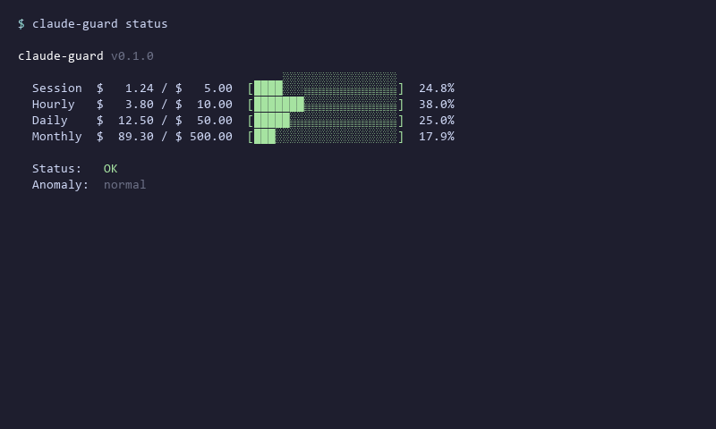

# claude-guard 🛡️

> **Never get a surprise Claude Code bill again.**



claude-guard is a **cost circuit breaker** for Claude Code. It monitors your API spending in real-time and **automatically blocks tool calls** when you hit your budget — before the damage is done.

Other tools show you the bill after the fact. claude-guard **prevents** the bill.

```
Session:  $4.82 / $5.00  [████████████████████░] 96.4%  ⚠ WARNING
Hourly:   $8.12 / $10.00 [████████████████░░░░░] 81.2%  ⚠ WARNING
Daily:    $18.50 / $50.00 [███████░░░░░░░░░░░░░░] 37.0%
Monthly:  $142.30 / $500  [██████░░░░░░░░░░░░░░░] 28.5%

⛔ Session budget exceeded → tool call BLOCKED
```

## The Problem

Claude Code is powerful. It's also expensive. A single runaway agent loop can burn through hundreds of dollars in minutes:

- **$2,000+ surprise bills** from forgotten background tasks
- **$500+ daily spikes** when agents get stuck in retry loops
- Costs compound fast when agents run overnight or hit retry loops

Claude Code's built-in `sessionLimit` and `dailyLimit` only **warn** — they don't **stop**. By the time you see the warning, the money is already gone.

## The Solution

claude-guard plugs into Claude Code's hook system and acts as a **hard circuit breaker**:

- **PreToolUse hook** → checks budget before every tool call
- **Over budget** → blocks the tool (`permissionDecision: "deny"`)
- **Way over budget** → kills the session (`continue: false`)
- **Spending spike** → anomaly alert within seconds

**Zero dependencies.** Pure Python stdlib. Installs in 30 seconds.

## Quick Start

```bash
# Install
pip install claude-guard

# Create config with defaults ($5/session, $10/hour, $50/day, $500/month)
claude-guard init

# Install as Claude Code plugin
claude-guard install

# Check your current spend
claude-guard status
```

That's it. claude-guard is now watching every tool call.

## How It Works

```
┌─────────────────────────────────────────────────┐
│                  Claude Code                     │
│                                                  │
│  Tool Call ──→ PreToolUse Hook ──→ claude-guard  │
│                                     │            │
│                              Budget check:       │
│                              OK → allow          │
│                              80%+ → warn         │
│                              100%+ → DENY tool   │
│                              150%+ → KILL session│
│                                                  │
│  After Call ──→ PostToolUse Hook ──→ log cost    │
└─────────────────────────────────────────────────┘
```

### Budget Windows

| Window | Default | What it prevents |
|--------|---------|-----------------|
| Session | $5.00 | Single task running wild |
| Hourly | $10.00 | Sustained expensive loops |
| Daily | $50.00 | All-day background agents |
| Monthly | $500.00 | Cumulative drift |

### Actions

| Threshold | Action | What happens |
|-----------|--------|-------------|
| < 80% | ✅ Allow | Normal operation |
| ≥ 80% | ⚠️ Warn | System message to Claude |
| ≥ 100% | ⛔ Deny | Tool call blocked, reason shown |
| ≥ 150% | 💀 Kill | Session terminated immediately |

### Anomaly Detection

claude-guard watches your spending *rate*, not just totals. If your cost-per-minute suddenly spikes 3x above your rolling average, it fires an alert — catching runaway loops before they hit the hard limit.

## Configuration

Config lives at `~/.claude-guard.json`:

```json
{
  "budgets": {
    "session": 5.00,
    "hourly": 10.00,
    "daily": 50.00,
    "monthly": 500.00
  },
  "alerts": {
    "warn_at_percent": 80,
    "sound": true
  },
  "anomaly": {
    "spike_multiplier": 3.0,
    "lookback_window_minutes": 30
  },
  "action_on_limit": "deny",
  "action_on_hard_limit": "kill"
}
```

Set budgets from CLI:

```bash
claude-guard set daily 25      # $25/day
claude-guard set session 10    # $10/session
claude-guard set monthly 200   # $200/month
```

Set a budget to `0` to disable that window.

## CLI Commands

```bash
claude-guard init              # Create default config
claude-guard status            # Show current spend vs limits
claude-guard history           # Show cost history
claude-guard set <window> <$>  # Set budget limit
claude-guard reset [session|daily|all]  # Reset counters
claude-guard watch             # Live cost monitor (foreground)
claude-guard install           # Install as Claude Code plugin
claude-guard uninstall         # Remove plugin
```

## How It Compares

| Feature | claude-guard | claude-hud | ccusage | cccost |
|---------|:-----------:|:----------:|:-------:|:------:|
| **Prevents** overspend | ✅ | ❌ | ❌ | ❌ |
| Real-time monitoring | ✅ | ✅ | ❌ | ✅ |
| Hard budget enforcement | ✅ | ❌ | ❌ | ❌ |
| Auto-kill runaway sessions | ✅ | ❌ | ❌ | ❌ |
| Anomaly/spike detection | ✅ | ❌ | ❌ | ❌ |
| Session/hourly/daily/monthly | ✅ | ❌ | ✅ | ❌ |
| Zero dependencies | ✅ | ❌ | ❌ | ✅ |
| Claude Code plugin | ✅ | ✅ | ❌ | ❌ |

**claude-hud** is a dashboard. **ccusage** is a post-hoc analyzer. **cccost** is a logger.

**claude-guard is a circuit breaker.** It's the difference between a speedometer and a brake pedal.

## Supported Models

| Model | Input | Output | Cache Read | Cache Create |
|-------|------:|-------:|-----------:|-------------:|
| claude-opus-4-6 | $15.00/M | $75.00/M | $1.875/M | $18.75/M |
| claude-sonnet-4-6 | $3.00/M | $15.00/M | $0.375/M | $3.75/M |
| claude-haiku-4-5 | $0.80/M | $4.00/M | $0.08/M | $1.00/M |

Prices per million tokens. Unknown models default to Sonnet pricing.

## Requirements

- Python 3.10+
- Claude Code (for plugin mode)
- No external dependencies

## FAQ

**Q: Will this slow down Claude Code?**
A: No. The budget check reads a JSON file and does arithmetic. It runs in <10ms — well under the 5-second hook timeout.

**Q: What if I want to go over budget temporarily?**
A: `claude-guard set session 0` disables the session limit. Or `claude-guard reset session` resets the counter.

**Q: Does this work with the Claude API directly?**
A: claude-guard is designed for Claude Code specifically. It monitors session JSONL files and uses Claude Code's hook system. For direct API usage, set budget limits on your API key in the Anthropic Console.

**Q: Can I use this with other AI coding tools?**
A: Currently Claude Code only. The architecture is extensible — PRs welcome for Cursor, Windsurf, etc.

## Contributing

PRs welcome. Please include tests.

```bash
# Run tests
python -m pytest tests/ -v

# Run a specific test file
python -m pytest tests/test_engine.py -v
```

## License

MIT
